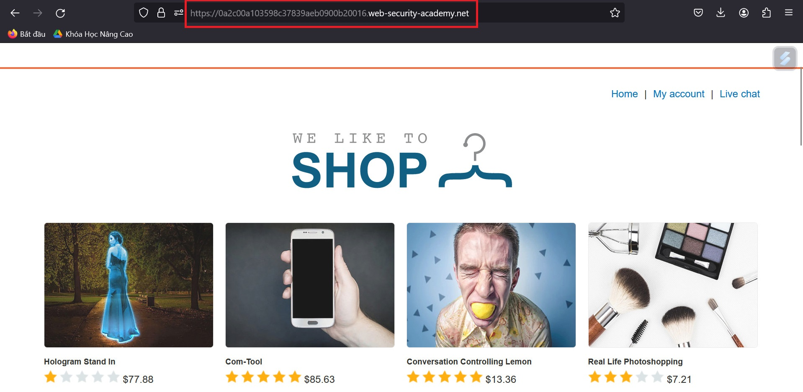
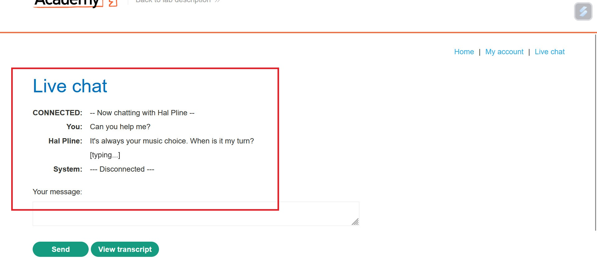
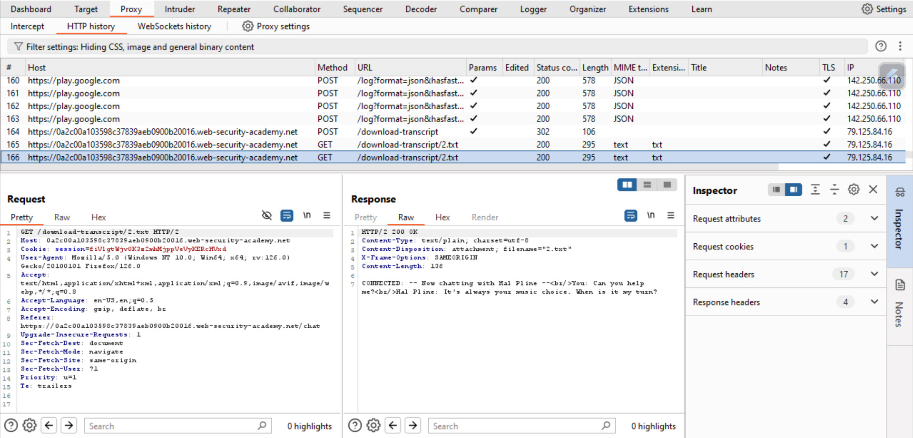
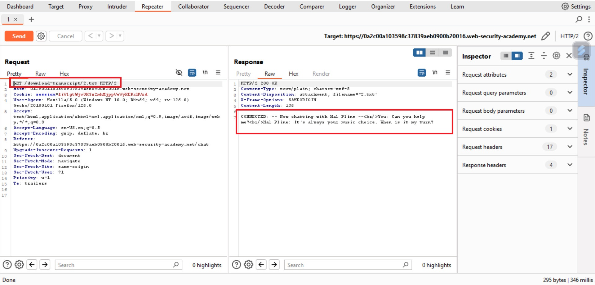
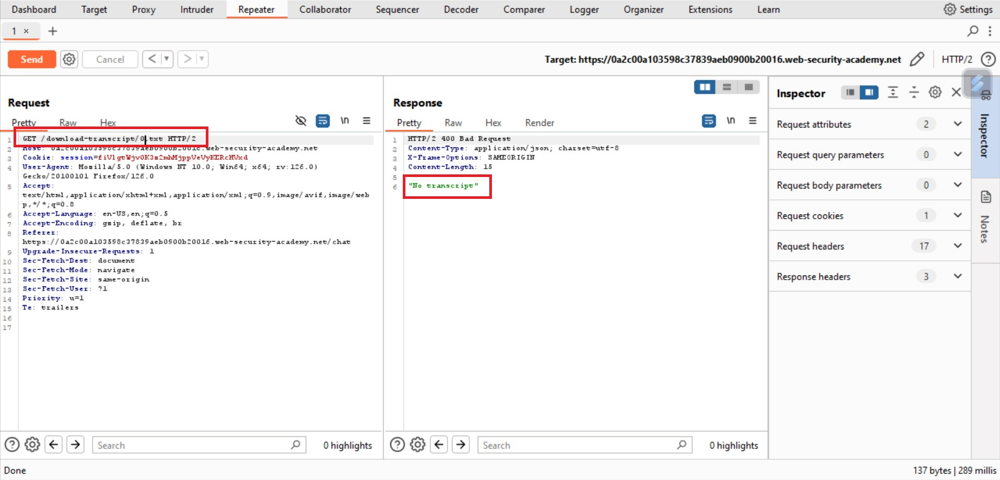
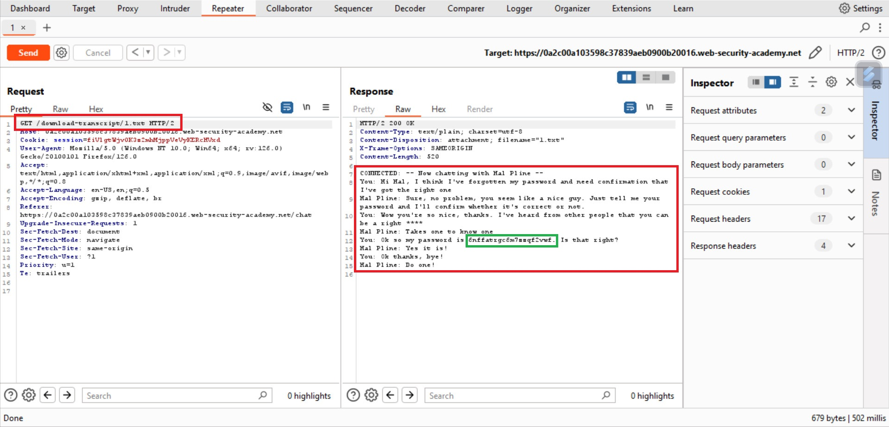

# IDOR vulnerability analysis and assessment: Potential threat to network security

<small>*Update date: May 22, 2024 - 15:30*</small>

## Main content:
[I. Definition of IDOR](#definition-of-idor)

[II. IDOR vulnerability with direct reference to database object](#idor-vulnerability-with-direct-reference-to-database-object)

[III. IDOR vulnerability with direct reference to static file](#idor-vulnerability-with-direct-reference-to-static-file)

[IV. Causes and consequences of IDOR (Insecure Direct Object Reference)](#causes-and-consequences-of-idor-vulnerability)

[V. Exploit IDOR (Insecure Direct Object Reference)](#exploit-idor-bug)
- [1. Manually check for IDOR errors](#manually-check-for-idor-errors)
- [2. Use Burp Suite to check IDOR errors](#use-burp-suite-to-check-idor-errors)

[VI. How to prevent IDOR (Insecure Direct Object Reference) errors](#how-to-prevent-idor-errors)

<a name="definition-of-idor"></a>
## I. Definition of IDOR:

`IDOR` stands for `Insecure Direct Object Reference`. This is a common type of security vulnerability in web applications, occurring when the application uses user-supplied input to directly access objects (such as files, database records) without any additional verification measures.

Simply put, we have a key to open mailbox number 4, but instead of only opening mailbox number 4, it can open other mailboxes, not just number 4. So All mailboxes have IDOR errors because we can open any mailbox with the current key.

The term IDOR has been widely known since appearing in [OWASP Top 10 Vulnerabilities of 2007](https://owasp.org/www-chapter-belgium/assets/2007/2007-03-21/OWASP%20Intro%20and%20Top%2010%202007.pdf). However, this is just one of many access control implementation errors that can lead to controls being bypassed. IDOR vulnerabilities are typically associated with horizontal privilege escalation, but can also occur with vertical privilege escalation.

<a name="idor-vulnerability-with-direct-reference-to-database-object"></a>
## II. IDOR vulnerability with direct reference to database object:

Suppose a website has a function that allows users to view their profile information. The website uses the user ID to access the corresponding database record:
```
https://insecure-website.com/customer_account?customer_ID=132355
```
We can see that our user ID is `132355`, and it returns all of our information. We can see all the information of the user whose ID is `122222` because there is no identity check before the server returns the user's personal information. The server did not verify that we were in fact user `122222` or an impostor. It simply returns the information, as we requested to the website. This is an example of **horizontal privilege escalation**.

<a name="idor-vulnerability-with-direct-reference-to-static-file"></a>
## III. IDOR vulnerability with direct reference to static file:

IDOR vulnerability with direct reference to static file **(Insecure Direct Object Reference with Static File Access)** is a serious web security vulnerability. It occurs when a web application stores user data on the server's file system as `static files`, and then allow access to these files using `direct URL`.

**How it works:**

1. **Direct Storage:** The application stores user data, such as chat logs, as static files on the server's file system.
2. **Static URL:** The application uses static URLs, which are not encrypted or securely processed, to access and display these files to users. These URLs often contain a parameter or path element that identifies the specific file.
3. **Weak access control:** The application does not implement strong enough access control to ensure only authorized users can access their files. An attacker can take advantage of this to guess or manipulate URL input to access other users' files.

Suppose chat logs are stored as files with names based on the user ID. The URL to access a user's chat log might look like:

```
https://www.example.com/logs/user_carlos.txt
```

If the application does not check whether the requesting user is the legitimate owner of that chat log, an attacker could change `carlos` to another user ID (e.g., "maria") to view that user's private chat logs.

<a name="causes-and-consequences-of-idor-vulnerability"></a>
## IV. Causes and consequences of IDOR (Insecure Direct Object Reference) vulnerability:

### Causes:

IDOR vulnerabilities often stem from mistakes in the web application's access control implementation. Common causes include:

* **Direct use of user input to access objects:** Application use of user IDs, filenames, or other information provided by the user to directly access objects without verification testing is the main cause of IDOR vulnerabilities.
* **Lack of role-based access control:** The application does not differentiate users based on roles and permissions, leading to users being able to gain unauthorized access to objects they are not authorized to.
* **Using weak access identifiers:** Access identifiers used to access objects are not strong or predictable enough, making it easy for attackers to spoof to gain unauthorized access.

### Consequence:

IDOR vulnerabilities can lead to many serious consequences for web applications and users, including:

* **Disclosure of sensitive information:** An attacker could access another user's personal information, financial data, or other sensitive information.
* **Data Modification:** An attacker can modify or delete another user's data, causing financial loss or reputational damage.
* **Execution of malicious code:** An attacker can upload malicious code to the server and execute it, causing system damage or data theft.
* **Elevation of Privilege:** Attackers can exploit the IDOR vulnerability to elevate their authority within the application, allowing them to perform unauthorized actions that they would not normally be allowed to take.

**In addition, IDOR vulnerabilities can also reduce the reputation of web applications and organizations, affecting user trust.**

<a name="exploit-idor-bug"></a>
## V. Exploiting the IDOR (Insecure Direct Object Reference) bug:

To be able to strengthen our website more securely, we must first find the vulnerabilities in the system before the bad guys and fix them as soon as possible, avoiding heavy losses later.

<a name="manually-check-for-idor-errors"></a>
### 1. Manually check IDOR errors:

- **Determine points that can check IDOR**:
    - Find parameters in URLs, POST values, or any parameter that may refer to a specific object.

- **Change reference value**:
    - Change the value of the parameter to check whether another object's data can be accessed or changed. For example:
    ```
    http://example.com/user?id=12345 -> http://example.com/user?id=12346
    ```

- **Observe results**:
    - Check to see if we can access other objects' information. If so, this is an indication of an IDOR error.

<a name="use-burp-suite-to-check-idor-errors"></a>
### 2. Use Burp Suite to check IDOR errors:

We'll walk through a simple example of extracting user chat logs directly on the server's filesystem and retrieving them using static URLs. The goal is to find the password of user `carlos` and log in to his account.

- Use __Burp Suite__ to intercept HTTP requests when we access URLs with parameters. We will try with the website [https://web-security-academy.net/](https://0a7a002e0423530b83e5611800750088.web-security-academy.net/).\


- When we access 'Live chat' and start texting, we will receive a response as shown in the image. Next, we click on `View transcript` and we will download a file named `2.txt`.\


- Open __Burp Suite__ and look at `Proxy\HTTP History`, we can see that it records the URL information to download the file containing our chat history from earlier as shown in the picture.\


- Next we add this URL to the `Repeater` tab, and then press `Send`, then in the `Response` section we will receive information about our previous chat.\


- Notice that our chat information is saved in a file called "2.txt", so perhaps the user's chat information we need to find will be in "0.txt" or "1. txt". We edit the information in the `Request` section, rename the file to "0.txt" as shown in the image.\


- Because "0.txt" does not have any content, we continue to rename it to "1.txt" and then `Send`, we will receive the chat information as shown in the picture. This chat is exactly what we need to find to get the password of user `carlos`.\


<a name="how-to-prevent-idor-errors"></a>
## VI. How to prevent IDOR (Insecure Direct Object Reference) errors:

IDOR error is a serious web security vulnerability that can occur when a web application uses user input to directly access objects (such as files, database records) without authorization. Additional verification measures. Attackers can take advantage of this to access objects they are not authorized to access, or to perform unauthorized actions.

**Here are some ways to prevent IDOR errors:**

1. **Use strong access identifiers:**

    * Instead of using user IDs, filenames, or other user-supplied information to access objects directly, use random access identifiers that are difficult to guess and are long enough to ensure protect objects.
    * For example, instead of using `user_id=123` in the URL to access the user's profile, use a random access identifier such as `user_token=a1b2c3d4e5f6g7h8i9j0k1l2m3n4o5p6q7r8s9t0u1v2w3x4y5z6`.

2. **Implement role-based access control:**

    * Differentiate users based on roles and permissions, granting access only to the objects they need to perform their tasks.
    * For example, only allow administrators access to admin settings, and only allow users access to their own profiles.

3. **Verify user input:**

    * Always check and verify user input before using it to access objects.
    * For example, ensure that the user ID is valid and exists before accessing their profile.

4. **Use encryption:**

    * Encrypt sensitive data when stored and transmitted to minimize the risk of theft.
    * For example, encrypt user passwords and other sensitive information.

5. **Regular software updates:**

    * Install the latest security updates for server software and web applications to patch discovered vulnerabilities.

6. **Improve employee awareness:**

    * Raise employee awareness about security vulnerabilities and teach them how to use web applications safely.

**For example:**

Suppose a website allows users to download files based on the filename in the URL. The IDOR vulnerability can occur if a website does not check whether the filename is valid. An attacker could take advantage of this to upload malicious files to the server by changing the filename in the URL.

To prevent this, the website can use a random access identifier for each file. When a user wants to download a file, they are provided with an access identifier instead of the file name. The URL to download the file will look like:

```
https://www.example.com/download?file_token=a1b2c3d4e5f6g7h8i9j0k1l2m3n4o5p6q7r8s9t0u1v2w3x4y5z6
```

This way, an attacker cannot guess or manipulate file names to upload malicious files to the server.

The __IDOR (Insecure Direct Object Reference)__ vulnerability is a serious web security vulnerability that can lead to serious consequences such as sensitive information disclosure, data modification, and identity spoofing. Therefore, preventing this vulnerability is very important. By taking the above precautions, web developers can help minimize the risk of IDOR exploits and protect their user data. In addition, raising user awareness about security vulnerabilities and how to use the internet safely also plays an important role in protecting cybersecurity.